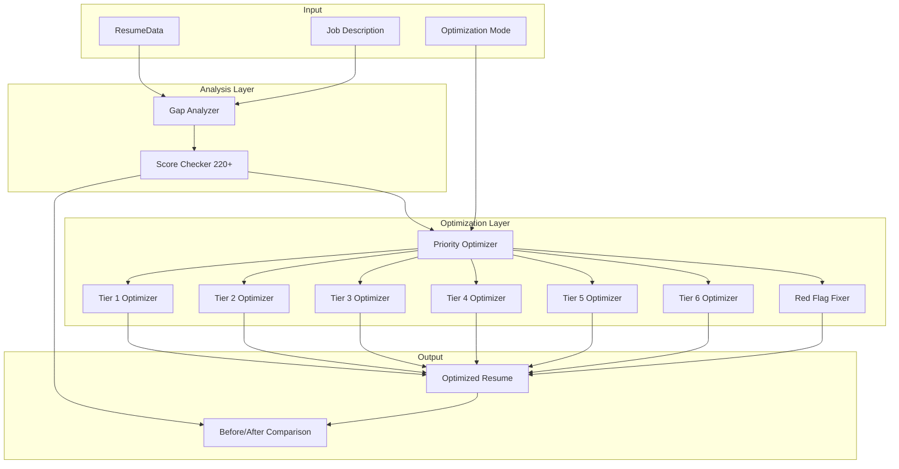

# Design Document: Enhanced JD-Based Resume Optimizer (220+ Metrics)

## Overview

The Enhanced JD-Based Resume Optimizer uses the same **220+ metric scoring framework** as the ATS Score Checker to analyze and optimize resumes. This ensures consistency - what gets measured gets improved. The optimizer performs gap analysis across all 10 tiers, prioritizes improvements based on metric weights, and systematically enhances the resume to maximize ATS scores.

### Key Capabilities
- Gap analysis using 220+ metrics across 10 tiers
- Priority-based optimization (Big 5 metrics first)
- Tier-by-tier systematic improvements
- Red flag elimination
- Before/after score comparison
- 3 optimization modes (Light, Standard, Aggressive)

## Architecture



## Components and Interfaces

### 1. EnhancedJDOptimizerService

```typescript
interface EnhancedJDOptimizerServiceInterface {
  optimizeResume(
    resumeData: ResumeData,
    jobDescription: string,
    targetRole: string,
    mode: OptimizationMode
  ): Promise<OptimizationResult>;
}

type OptimizationMode = 'light' | 'standard' | 'aggressive';
```

### 2. GapAnalyzer

```typescript
interface GapAnalyzerInterface {
  analyzeGaps(
    resumeData: ResumeData,
    jobDescription: string
  ): GapAnalysisResult;
}

interface GapAnalysisResult {
  beforeScore: ComprehensiveScore;
  tierGaps: TierGap[];
  big5Gaps: Big5Gap[];
  prioritizedImprovements: Improvement[];
  redFlags: RedFlag[];
}

interface TierGap {
  tierNumber: number;
  tierName: string;
  currentScore: number;
  maxScore: number;
  failingMetrics: FailingMetric[];
}

interface FailingMetric {
  metricId: number;
  metricName: string;
  currentValue: string;
  expectedValue: string;
  impact: number;
  recommendation: string;
}

interface Big5Gap {
  metric: 'jd_keywords_match' | 'technical_skills_alignment' | 'quantified_results' | 'job_title_relevance' | 'experience_relevance';
  currentScore: number;
  maxScore: number;
  gap: number;
  priority: 'critical' | 'high' | 'medium';
  improvements: string[];
}
```

### 3. TierOptimizers

```typescript
interface TierOptimizerInterface {
  optimize(
    resumeData: ResumeData,
    gaps: TierGap,
    jdAnalysis: JDAnalysisResult,
    mode: OptimizationMode
  ): Promise<Partial<ResumeData>>;
}
```

## Data Models

### OptimizationResult

```typescript
interface OptimizationResult {
  optimizedResume: ResumeData;
  
  // Scores
  beforeScore: ComprehensiveScore;
  afterScore: ComprehensiveScore;
  scoreImprovement: number;
  
  // Tier comparisons
  tierComparison: TierComparison[];
  
  // Big 5 improvements
  big5Improvements: Big5Improvement[];
  
  // Changes made
  changesBySection: SectionChanges[];
  totalChanges: number;
  
  // Keywords
  keywordsAdded: string[];
  keywordMatchBefore: number;
  keywordMatchAfter: number;
  
  // Red flags
  redFlagsFixed: string[];
  redFlagsRemaining: string[];
  
  // Metadata
  optimizationMode: OptimizationMode;
  processingTime: number;
}

interface TierComparison {
  tierNumber: number;
  tierName: string;
  beforeScore: number;
  afterScore: number;
  improvement: number;
  metricsImproved: number;
}

interface Big5Improvement {
  metric: string;
  beforeScore: number;
  afterScore: number;
  improvement: number;
  changesApplied: string[];
}

interface SectionChanges {
  section: string;
  changeType: 'added' | 'modified' | 'rewritten' | 'reordered';
  description: string;
  before?: string;
  after?: string;
}
```

### Optimization Mode Configurations

```typescript
const OPTIMIZATION_MODES = {
  light: {
    addMissingKeywords: true,
    rewriteBullets: false,
    restructureSections: false,
    generateSummary: false,
    maxChangesPerSection: 2
  },
  standard: {
    addMissingKeywords: true,
    rewriteBullets: true,
    restructureSections: false,
    generateSummary: true,
    maxChangesPerSection: 5
  },
  aggressive: {
    addMissingKeywords: true,
    rewriteBullets: true,
    restructureSections: true,
    generateSummary: true,
    maxChangesPerSection: 10
  }
};
```

## Correctness Properties

*A property is a characteristic or behavior that should hold true across all valid executions of a system.*

### Property 1: Gap Analysis Contains All 10 Tiers
*For any* resume and JD input, the gap analysis result should contain gaps for all 10 tiers.
**Validates: Requirements 1.1, 1.2**

### Property 2: Big 5 Gaps Flagged as Highest Priority
*For any* gap analysis with Big 5 metric failures, those gaps should appear first in the prioritized improvements list.
**Validates: Requirements 1.4**

### Property 3: Optimized Resume is Valid ResumeData
*For any* optimization result, the optimizedResume should be a valid ResumeData object with all required fields.
**Validates: Requirements 9.1**

### Property 4: Predicted Score Between 0-100
*For any* optimization result, the afterScore.overall should be between 0 and 100.
**Validates: Requirements 9.2**

### Property 5: Score Improvement Non-Negative
*For any* optimization result, the afterScore should be greater than or equal to beforeScore (optimization should not make things worse).
**Validates: Requirements 9.2**

### Property 6: Changes List Non-Empty
*For any* optimization result where gaps exist, the changesBySection array should be non-empty.
**Validates: Requirements 9.3**

### Property 7: Before/After Tier Scores Present
*For any* optimization result, the tierComparison array should contain 10 items with both before and after scores.
**Validates: Requirements 9.4**

### Property 8: Big 5 Improvements Tracked
*For any* optimization result, the big5Improvements array should contain all 5 critical metrics.
**Validates: Requirements 9.5**

### Property 9: Light Mode Minimal Changes
*For any* optimization with mode='light', the total changes should be less than or equal to the sum of maxChangesPerSection across all sections.
**Validates: Requirements 10.1**

### Property 10: Aggressive Mode More Changes Than Standard
*For any* resume with gaps, aggressive mode should produce more changes than standard mode.
**Validates: Requirements 10.2, 10.3**

### Property 11: Keywords Added in Skills Section
*For any* optimization where JD keywords are missing, the keywordsAdded array should be non-empty and those keywords should appear in the optimized resume.
**Validates: Requirements 6.1**

### Property 12: Experience Bullets Have Action Verbs
*For any* optimization in standard or aggressive mode, experience bullets should start with action verbs.
**Validates: Requirements 4.3**

## Error Handling

### Input Validation
- Empty resume: Return error "Resume data is required"
- Empty JD: Return error "Job description is required"
- Invalid mode: Default to 'standard'

### Optimization Failures
- AI service failure: Retry 3 times, then return partial optimization
- Section optimization failure: Skip section, continue with others

## Testing Strategy

### Property-Based Testing
Using **fast-check** with 100 iterations per test.

### Test Annotation Format
```typescript
/**
 * **Feature: enhanced-jd-optimizer, Property N: Description**
 * **Validates: Requirements X.Y**
 */
```
