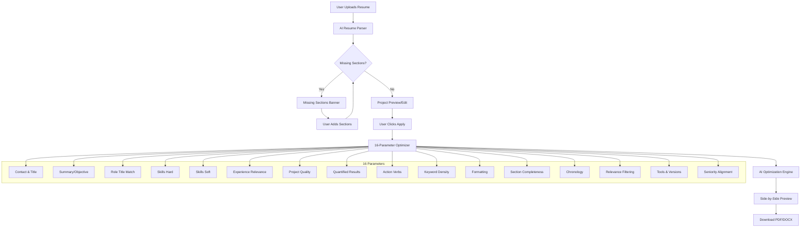

# Design Document

## Overview

This design document describes the 16-Parameter JD-Based Resume Optimizer system. The system follows a strict 5-step pipeline: AI Parsing → Missing Sections Check → Project Preview → Optimization → Final Preview. It replaces the old 220+ metrics approach with a focused 16-parameter scoring system that rewrites the entire resume against a job description.

## Architecture



## Components and Interfaces

### 1. JD Optimizer 16 Parameter Service
Main orchestrator service that coordinates the entire optimization pipeline.

```typescript
interface JDOptimizer16ParameterService {
  parseResume(input: ParseResumeInput): Promise<ParsedResumeResult>;
  checkMissingSections(parsedResume: ParsedResume): MissingSectionsResult;
  optimizeResume(input: OptimizeResumeInput): Promise<OptimizationResult>;
}
```

### 2. AI Resume Parser
Parses raw resume text/PDF into structured JSON using AI.

### 3. Missing Sections Checker
Validates parsed resume for required sections.

### 4. Project Preview Manager
Handles project editing and validation before optimization.

### 5. 16-Parameter Scoring Engine
Scores resume against each of the 16 parameters.

### 6. AI Optimization Engine
Calls AI with the PrimoResumeOptimizer prompt to rewrite resume.

## Data Models

### Parsed Resume Schema (Input/Output)

```typescript
interface ParsedResume {
  candidate: {
    name: string;
    contact: {
      email: string;
      phone: string;
      location: string;
      linkedin: string;
      portfolio: string;
    };
    title: string;
    summary: string;
  };
  sections: {
    experience: ExperienceItem[];
    projects: ProjectItem[];
    education: EducationItem[];
    skills: {
      technical: string[];
      tools: string[];
      soft: string[];
    };
    certifications: string[];
  };
  parsingMetadata: {
    parsingConfidence: number; // 0.0 - 1.0
    missingSections: string[];
  };
}

interface ExperienceItem {
  company: string;
  title: string;
  startDate: string; // YYYY-MM
  endDate: string;   // YYYY-MM | "Present"
  location: string;
  bullets: string[];
  tech: string[];
  impact: string[];
}

interface ProjectItem {
  name: string;
  description: string;
  role: string;
  tech: string[];
  metrics: string[];
  link: string;
}

interface EducationItem {
  institution: string;
  degree: string;
  year: string;
}
```

### Optimization Input

```typescript
interface OptimizeResumeInput {
  parsedResume: ParsedResume;
  jobDescription: string;
  parameters: string[]; // All 16 parameter names
  projectEdits?: ProjectItem[]; // Optional user changes from preview
}
```

### Optimization Result

```typescript
interface OptimizationResult {
  optimizedResumeText: string;
  optimizedParsedResume: ParsedResume;
  parameterScores: {
    [parameterName: string]: {
      score: number; // 0.0 - 1.0
      note: string;
    };
  };
  suggestions: string[]; // Prefixed with [CONFIRM] when user action needed
  confidence: 'high' | 'medium' | 'low';
  overallScore: number; // Weighted average of all 16
}
```

### The 16 Parameters Definition

```typescript
const SIXTEEN_PARAMETERS = [
  { id: 'contact_title', name: 'Contact & Title', weight: 5 },
  { id: 'summary_objective', name: 'Summary/Objective', weight: 8 },
  { id: 'role_title_match', name: 'Role Title Match', weight: 10 },
  { id: 'skills_hard', name: 'Skills Match (Hard)', weight: 12 },
  { id: 'skills_soft', name: 'Skills Match (Soft)', weight: 5 },
  { id: 'experience_relevance', name: 'Experience Relevance', weight: 12 },
  { id: 'project_quality', name: 'Project Quality', weight: 8 },
  { id: 'quantified_results', name: 'Quantified Results', weight: 10 },
  { id: 'action_verbs', name: 'Action Verbs & Impact', weight: 6 },
  { id: 'keyword_density', name: 'Keyword Density/ATS', weight: 8 },
  { id: 'formatting', name: 'Formatting & Readability', weight: 4 },
  { id: 'section_completeness', name: 'Section Completeness', weight: 4 },
  { id: 'chronology', name: 'Chronology & Dates', weight: 3 },
  { id: 'relevance_filtering', name: 'Relevance Filtering', weight: 2 },
  { id: 'tools_versions', name: 'Tools & Versions', weight: 2 },
  { id: 'seniority_alignment', name: 'Seniority/Scope Alignment', weight: 1 },
] as const;
// Total weight: 100
```

## Error Handling

| Error Type | Handling Strategy |
|------------|-------------------|
| AI Parsing Failure | Retry up to 2 times, then show error with retry button |
| Missing Required Sections | Block optimization until sections added |
| AI Optimization Failure | Retry up to 2 times, then show partial results if available |
| Invalid JD Input | Show validation error, require valid JD text |
| Malformed AI Response | Parse what's available, log error, retry if critical |

## Testing Strategy

### Unit Tests
- Test each of the 16 parameter scoring functions individually
- Test missing sections detection logic
- Test project edit merge logic
- Test AI response parsing

### Property-Based Tests
- Test that optimization preserves factual information (company names, dates)
- Test that all 16 parameters return scores between 0.0-1.0
- Test that suggestions array is always present
